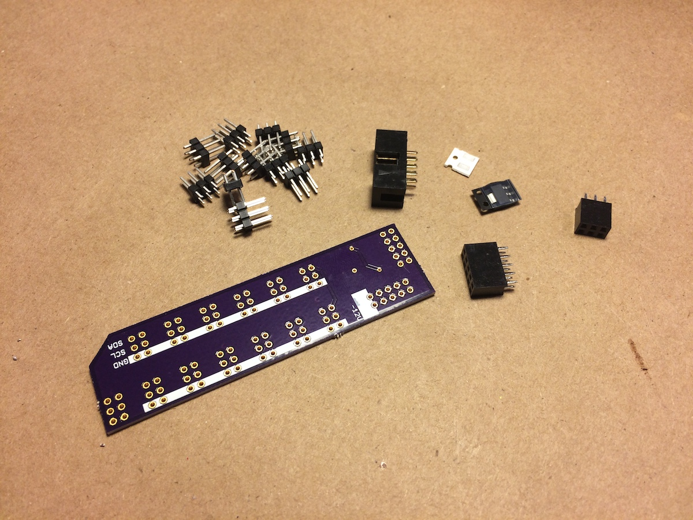

# teletype busboard

provides 12 ii headers and additional pull-up to support larger ii networks.

## bom

see http://digikey.com

* (1) header, female, 2x3 S7071-ND
* (12) header, male, 2x4 609-3218-ND 
* (1) 3v3 reg AZ1117CH-3.3TRG1DICT-ND
* (1) header, male, 2x5 S6105-ND 
* (2) resistor 1206 2.2k
* (1) header, male, shrouded, 2x5 ED1543-ND 

pcb via oshpark: https://oshpark.com/shared_projects/kg4mZSCg 

## guide

