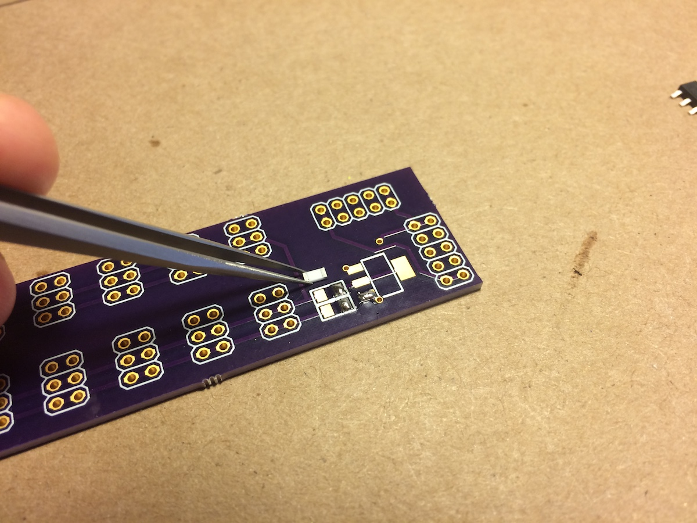
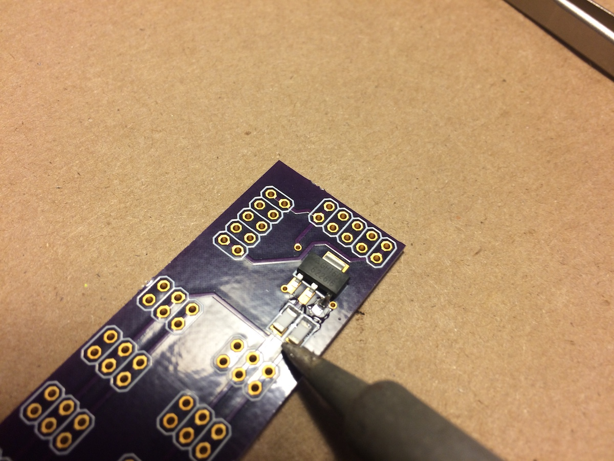
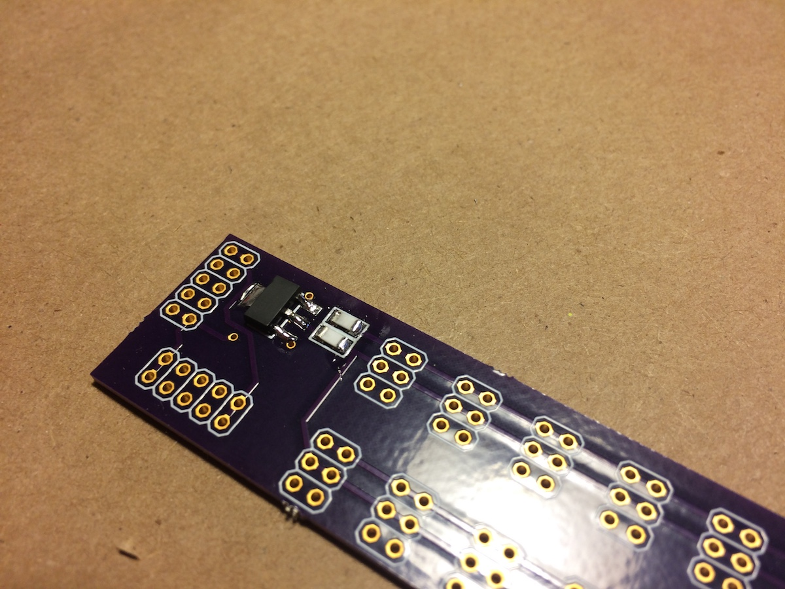
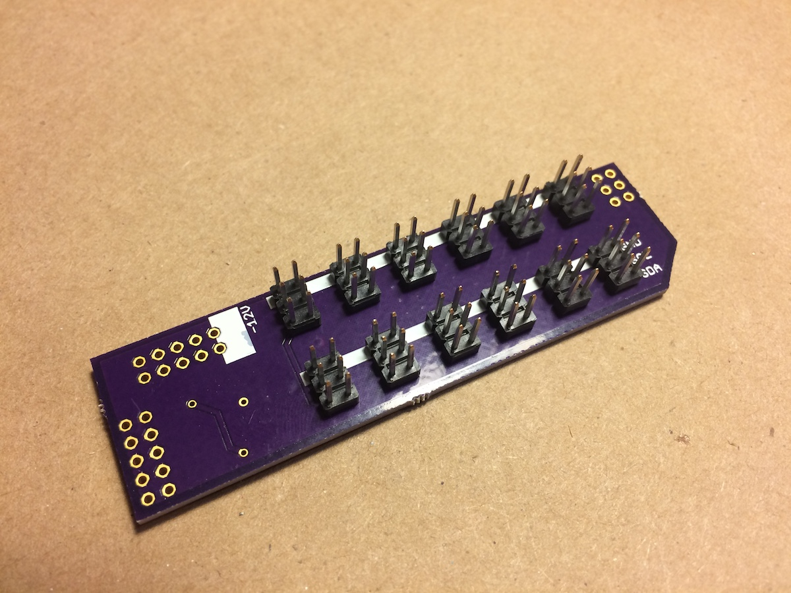
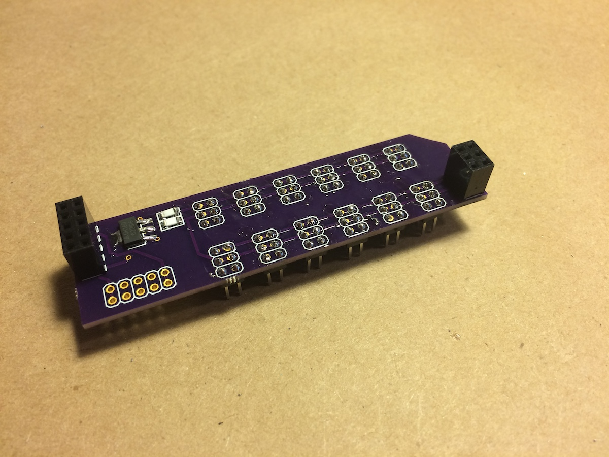
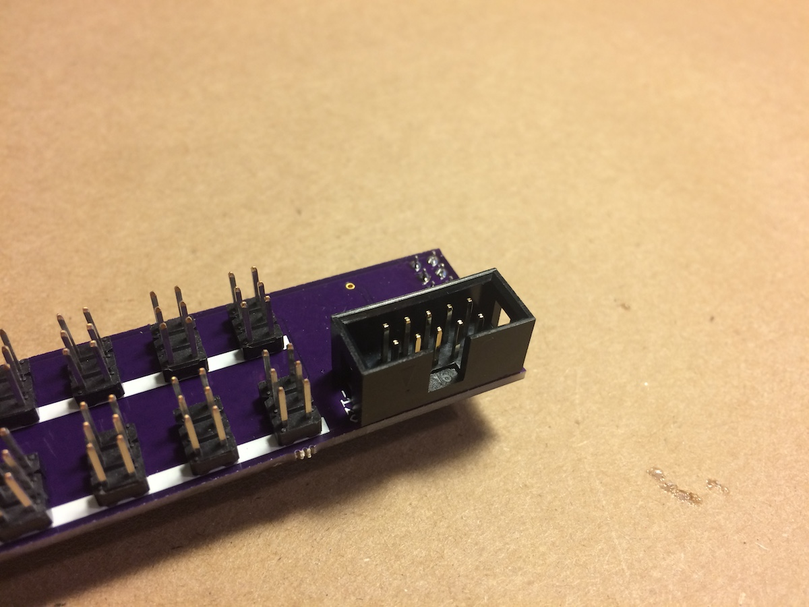

# teletype busboard

provides 12 ii headers and additional pull-up to support larger ii networks.

## bom

see http://digikey.com

* (1) header, female, 2x3 S7071-ND
* (12) header, male, 2x4 609-3218-ND 
* (1) 3v3 reg AZ1117CH-3.3TRG1DICT-ND
* (1) header, male, 2x5 S6105-ND 
* (2) resistor 1206 2.2k
* (1) header, male, shrouded, 2x5 ED1543-ND 

pcb via oshpark: https://oshpark.com/shared_projects/kg4mZSCg 

## guide

* full kit contents:

* solder the SMD pads first, one for each part. use tweezers to place the part while heating the soldered pad with the iron. pull the iron away while holding the part, let the solder cool.

* then solder the other remaining legs of the parts:

* should look more or less like this:

* insert the 12 headers as shown and then solder the other side. may require a trick to flip it without having them fall out-- try a bit of cardboard to hold it all together while flipping:

 

* insert female headers as shown then solder:

* insert the power header and solder. *IMPORTANT* make sure the key cutout is towards the outside of the board:

